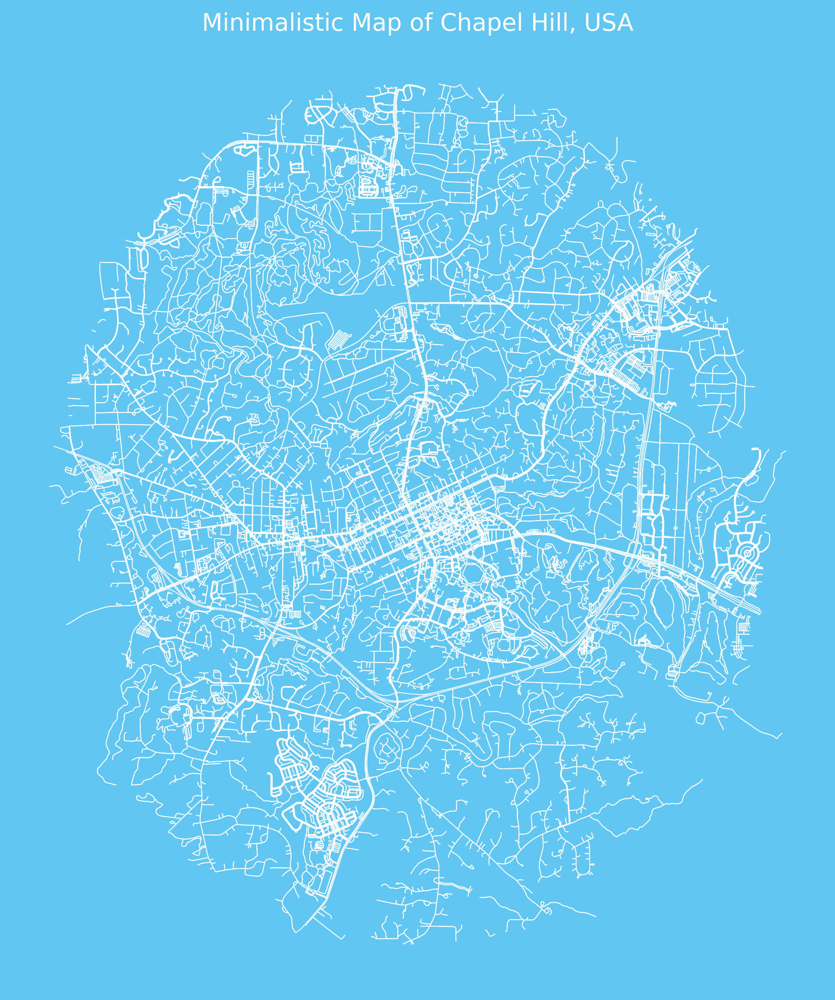

# Chapel Hill Minimalistic Map Visualization

This project generates a minimalistic map of Chapel Hill, North Carolina, using OpenStreetMap data. The map highlights the street network within a specified radius, styled with a dark grey background and white streets. It serves as an example of geospatial data analysis and visualization using Python.

## Features
- Fetches geospatial data from OpenStreetMap using OSMnx.
- Processes and visualizes street network data with customizable styles.
- Supports circular boundary filtering for maps.
- Includes an interactive Jupyter Notebook for reproducibility and exploration.

## Project Structure
```
Chapel-Hill-Map/
├── README.md           # Project description and usage instructions
├── map_generator.py    # Python script for generating the map
├── requirements.txt    # Required Python libraries
├── images/             # Folder for storing example output images
│   └── chapel_hill_map.png
└── notebooks/          # Interactive Jupyter Notebook
    └── Chapel_Hill_Map_Visualization.ipynb
```

## Requirements
To run this project, you will need:
- **Python 3.7 or higher**
- The following Python libraries:
  - `osmnx`
  - `matplotlib`
  - `geopy`
  - `shapely`

You can install all dependencies using:
```bash
pip install -r requirements.txt
```

## Usage

### Option 1: Run the Python Script
1. Clone the repository:
   ```bash
   git clone https://github.com/yourusername/Chapel-Hill-Map.git
   cd Chapel-Hill-Map
   ```

2. Run the Python script:
   ```bash
   python map_generator.py
   ```

### Option 2: Use the Jupyter Notebook
1. Open the Jupyter Notebook:
   ```bash
   jupyter notebook notebooks/Chapel_Hill_Map_Visualization.ipynb
   ```

2. Run the cells interactively to explore the data and generate the map.

## Example Output
Below is an example of the generated map for Chapel Hill, NC:



## About
This project demonstrates the following skills:
- **Geospatial Data Handling:** Efficiently using OpenStreetMap data with Python libraries like OSMnx and GeoPandas.
- **Data Visualization:** Customizing maps with Matplotlib to create visually appealing outputs.
- **Python Scripting:** Writing clean and reusable code for geospatial applications.
- **Interactive Notebooks:** Providing an interactive environment for exploration and reproducibility.

## Contributing
Contributions are welcome! Feel free to fork the repository and submit a pull request for any improvements or suggestions.

## Contact
For any questions or feedback, reach out via GitHub or email at `prabisha.shrestha@gmail.com`.
